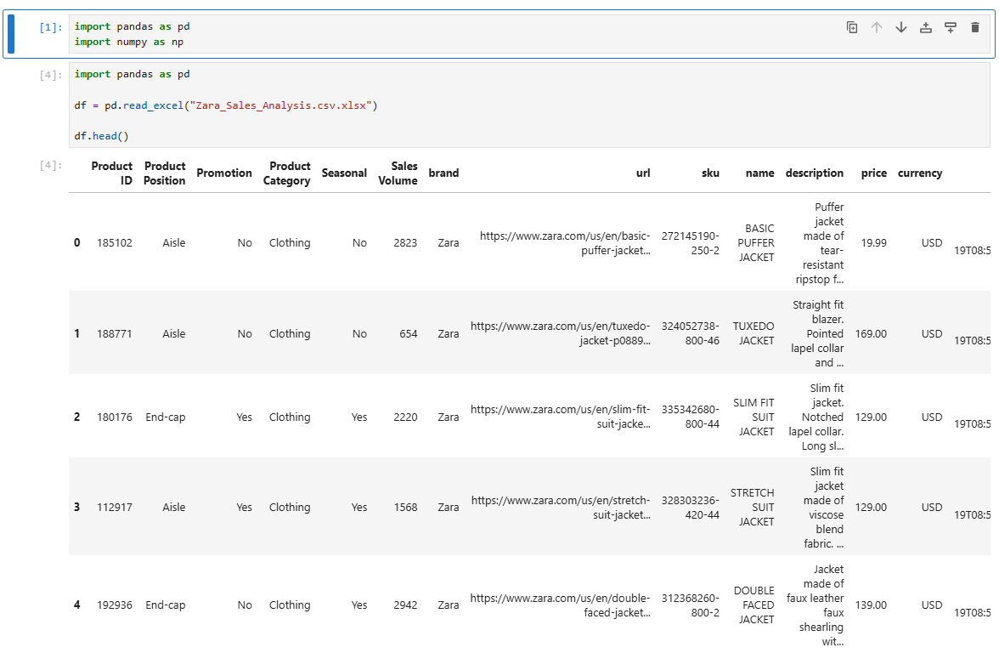
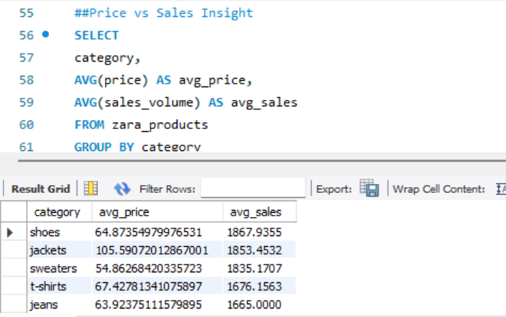
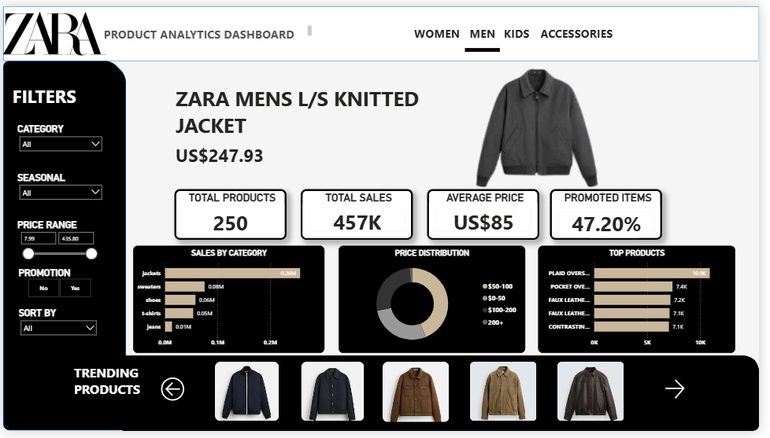

# Zara Product Analytics Dashboard

This project examines the data of Zara products in order to comprehend the sales performance.
pricing distribution, product popularity and promotion influence.

The project provides a full data analytics workflow of:

• Python Data Cleaning and Exploratory Data Analysis.
• SQL: Query and insight business.
• Power BI interactive dashboard.

## Tools & Technologies

- Python (Pandas, NumPy)
- SQL (MySQL)
- Power BI
- GitHub

  ## Dataset

The dataset contains product-level information scraped from Zara including:

- Product Category
- Product Name
- Price
- Sales Volume
- Promotion Status
- Seasonal Indicator

## Data Cleaning and Exploratory Data Analysis (Python)

The dataset was cleaned and analyzed using python.

Key tasks performed:
- Handling missing values
- Converting data types
- Aggregating sales metrics
- Category-wise analysis

## SQL Business Queries

SQL was used to extract business insights such as:

- Sales by category
- Promotion impact
- Top performing products

EXAMPLE-
SELECT category,
SUM(sales_volume)
FROM zara_products
GROUP BY category
ORDER BY SUM(sales_volume) DESC;

## Interactive Power BI Dashboard

An interactive dashboard was built to visualize key business insights.

Features:

- Category wise sales analysis
- Price distribution
- Top performing products
- Dynamic filters
- KPI indicators

  

  ## Key Insights

• Jackets generate the highest sales volume  
• Promotions significantly increase product performance  
• Most products fall within the $50–$100 price range  
• A small number of products contribute to a large portion of total sales

## Project Structure

zara-product-analytics

data/  
notebooks/  
sql/  
dashboard/  
images/  
screenshots/
